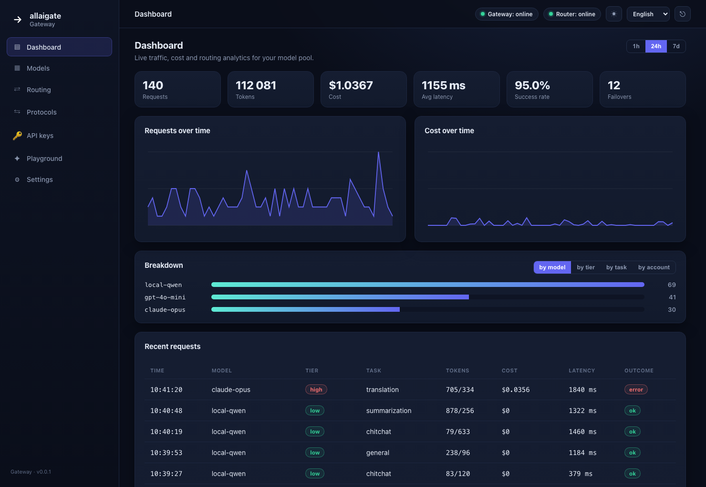
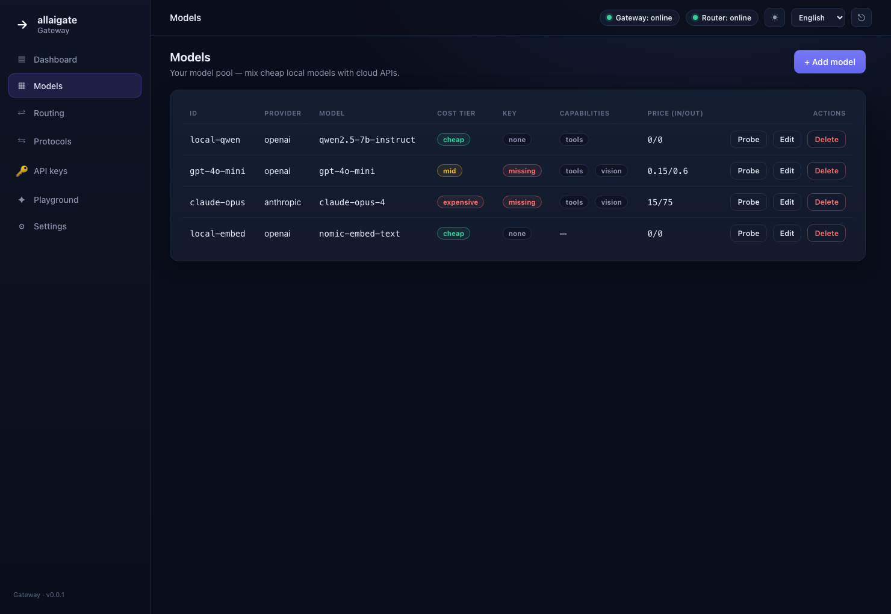
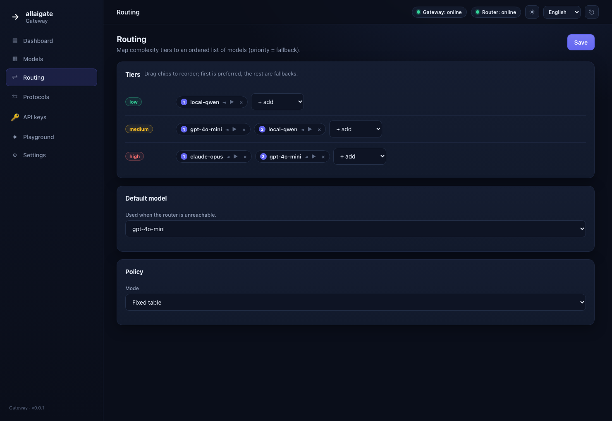
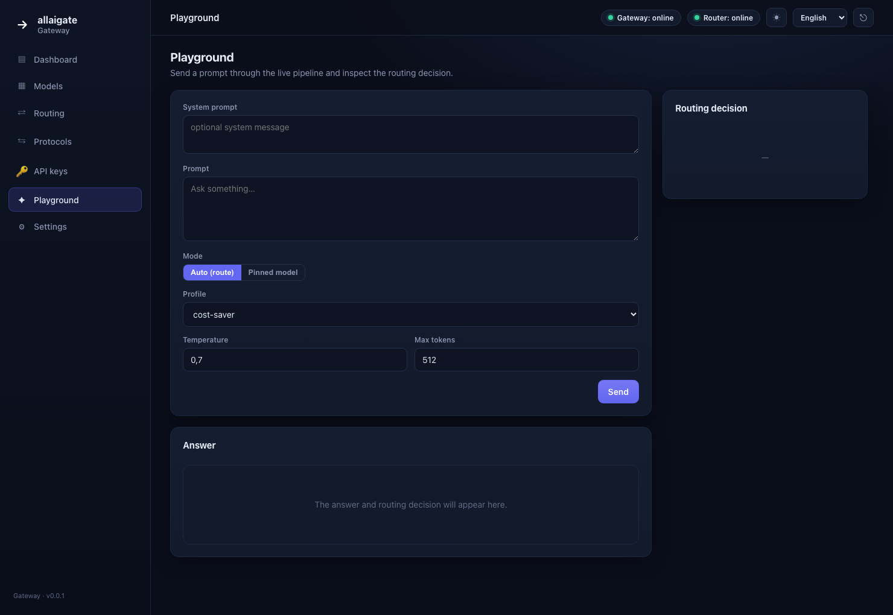

# Cortiq Gateway

[English](README.md) · **Русский**

[](LICENSE)


**Универсальный LLM-шлюз с интеллектуальной маршрутизацией.**
Один OpenAI-совместимый endpoint → автоматический выбор модели из вашего пула
(локальные дешёвые + хостовые дорогие) на основе типа задачи и сложности, которые
определяет [allaigate / cortiq-router](https://api.allaigate.com).

> Меняете в своём агенте/SDK только `base_url` — и получаете «умный» роутинг между
> моделями. Никакой логики выбора модели на стороне клиента.

```
┌─────────────┐   OpenAI / Anthropic / MCP    ┌──────────────────┐
│   Агент /   │ ─────────────────────────────▶│  Cortiq Gateway  │
│ разработчик │   (стандартный протокол)       │  (этот проект)   │
└─────────────┘ ◀─────────────────────────────└──────────────────┘
                        ответ + метаданные        │          │
                                                  │ /v1/route│ вызов LLM
                                                  ▼          ▼
                                         ┌──────────────┐  ┌─────────────────────┐
                                         │ cortiq-router│  │  Пул моделей        │
                                         │ (тип задачи, │  │  • local llama.cpp  │
                                         │  сложность)  │  │  • ollama / vLLM    │
                                         └──────────────┘  │  • OpenAI / Claude  │
                                                           └─────────────────────┘
```

---

## ✨ Ключевое

- **Drop-in OpenAI API.** Направьте любой OpenAI-клиент на шлюз и шлите `model: "cortiq-auto"`.
- **Интеллектуальный роутинг.** `complexity.tier` → упорядоченный пул моделей (`low → локально`, `high → облако`), с fallback и мягкой деградацией, если роутер недоступен.
- **Встроенная многоязычная панель управления.** Модели, роутинг, протоколы, ключи и секреты — из веб-интерфейса, **без ручного TOML и без рестарта** (горячая перезагрузка). **7 языков** (en, ru, de, fr, es, zh, tr), тёмная/светлая тема.
- **Живая аналитика.** Статистика по запросам (токены, стоимость, латентность, доля успеха, failover), графики, разбивка по моделям/полосам/задачам и Prometheus `GET /metrics`.
- **Playground.** Прогон промпта через живой пайплайн с разбором решения роутинга.
- **Один самодостаточный бинарь.** SPA встроена в Rust-бинарь — ничего лишнего разворачивать не нужно.
- **Секреты не покидают шлюз.** Агенты держат только виртуальный ключ шлюза; ключи провайдеров живут в шлюзе и наружу не уходят.

---

## 📦 Установка

```bash
# с crates.io
cargo install cortiq-gateway

# или сборка из исходников
git clone https://github.com/infosave2007/cortiq-gateway
cd cortiq-gateway
cargo build --release   # ./target/release/cortiq-gateway
```

---

## 🖥️ Панель управления



В шлюз встроена веб-панель на **`/admin`**:

| | |
|---|---|
|  |  |
| **Models** — добавление/правка/probe моделей, ключи провайдеров | **Routing** — визуальный редактор полос (упорядоченный) |
|  |  |
| **Playground** — тест живого пайплайна с решением роутинга | **Dashboard** — трафик, стоимость, латентность |

```bash
cargo run --release -- --config config/gateway.toml --admin-token <ВАШ_ТОКЕН>
# откройте  http://localhost:9000/admin?token=<ВАШ_ТОКЕН>
```

Если `--admin-token` / `[admin].token_env` не заданы — токен генерируется при старте и
печатается в лог. Все эндпоинты `/admin/api/*` требуют Bearer admin-токен; значения
секретов API наружу не отдаёт (только статус наличия: `store` / `env` / `missing`).

---

## 🚀 Быстрый старт

```bash
# 1. поднимите роутер (хостовый allaigate или локальный cortiq-router)
#    он слушает, например, http://localhost:8080 (или https://api.allaigate.com)

# 2. опишите свой пул моделей
cp config/gateway.example.toml config/gateway.toml
$EDITOR config/gateway.toml

# 3. запустите шлюз
cargo run --release -- --config config/gateway.toml
# Шлюз слушает 0.0.0.0:9000 и отдаёт панель на /admin
```

Теперь любой OpenAI-клиент работает через шлюз:

```python
from openai import OpenAI
client = OpenAI(base_url="http://localhost:9000/v1", api_key="sk-gw-...")

resp = client.chat.completions.create(
    model="cortiq-auto",                       # ← магическая модель = «выбери сам»
    messages=[{"role": "user", "content": "Solve x^2 - 5x + 6 = 0"}],
)
print(resp.choices[0].message.content)
# заголовки ответа покажут выбор шлюза:
#   X-Cortiq-Task-Label: math
#   X-Cortiq-Complexity-Tier: low
#   X-Cortiq-Selected-Model: local-qwen
```

`model: "cortiq-auto"` включает роутинг. Любое **реальное** имя модели из конфига
(`"gpt-4o-mini"`, `"local-qwen"`) — это passthrough напрямую, без роутинга.

> **Используете хостовый allaigate-роутер?** Укажите `url = "https://138.226.222.209"`,
> `verify_tls = false`, `taxonomy_id = "data-assistant"` и ключ `cortiq_…` в
> `CORTIQ_ROUTER_KEY`. На сложных запросах роутер эскалирует к oracle (~10 с), поэтому
> ставьте `timeout_ms = 12000+` — иначе шлюз мягко деградирует на default-модель.

---

## Поток запроса

1. Клиент → `POST /v1/chat/completions` (или Anthropic/MCP) с `model: "cortiq-auto"`.
2. Шлюз извлекает **текст для маршрутизации** (стратегия настраивается, см. [docs/ROUTING.ru.md](docs/ROUTING.ru.md)).
3. Шлюз → `cortiq-router /v1/route` → получает `task_label` + `complexity.tier`.
4. Шлюз выбирает модель из пула по таблице роутинга (с порядком fallback).
5. Шлюз → провайдер выбранной модели (транслируя протокол при необходимости), возвращает ответ.
6. Шлюз отдаёт метаданные роутинга в заголовках/`usage`, считает стоимость и статистику.

Подробно — [docs/ARCHITECTURE.ru.md](docs/ARCHITECTURE.ru.md).

---

## Поддерживаемые протоколы (входящие)

| Протокол | Endpoint | Статус |
|---|---|---|
| OpenAI Chat Completions | `POST /v1/chat/completions` | ✅ реализовано (+ стриминг) |
| OpenAI Embeddings | `POST /v1/embeddings` | ✅ реализовано |
| Anthropic Messages | `POST /v1/messages` | ✅ реализовано (+ стриминг) |
| MCP (Model Context Protocol) | `POST /mcp` (JSON-RPC) | ✅ реализовано |
| OpenAI Completions (legacy) | `POST /v1/completions` | план |
| OpenAI Models | `GET /v1/models` | план |
| Native passthrough | `POST /route` | план |

## Поддерживаемые провайдеры (исходящие)

| Провайдер | Покрывает |
|---|---|
| `openai` (OpenAI-совместимый) | OpenAI, OpenRouter, Together, Groq, **vLLM, llama.cpp server, LM Studio, Ollama (`/v1`)** |
| `anthropic` | Claude Messages API (+ стриминг) |
| `ollama` | нативный Ollama API |
| `http` | произвольный HTTP-эндпоинт (свой адаптер) |

---

## Конфигурация

Полный пример — [config/gateway.example.toml](config/gateway.example.toml).
Модель роутинга и cost-aware выбор — [docs/ROUTING.ru.md](docs/ROUTING.ru.md).
Всё из конфига также правится из панели управления в рантайме.

---

## Сборка и тесты

```bash
cargo build --release      # один самодостаточный бинарь (SPA встроена)
cargo test                 # round-trip конфига, валидация роутинга
```

---

## Статус

Реализовано: OpenAI Chat Completions **со стримингом (SSE)**, провайдер и вход
**Anthropic** `/v1/messages` (стриминг), **embeddings**, **семантический кэш**,
**MCP**-сервер, роутинг с fallback и мягкой деградацией, учёт стоимости/токенов,
**встроенная многоязычная панель управления с горячей перезагрузкой конфига**,
статистика и Prometheus `GET /metrics`. В планах: OpenAI Completions/Models, native
passthrough, per-account роутинг, feedback-loop. Дорожная карта —
[docs/ARCHITECTURE.ru.md](docs/ARCHITECTURE.ru.md). Контрибьюции приветствуются —
см. [CONTRIBUTING.ru.md](CONTRIBUTING.ru.md).

## Лицензия

Apache-2.0 — см. [LICENSE](LICENSE).
